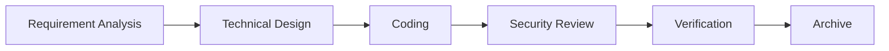
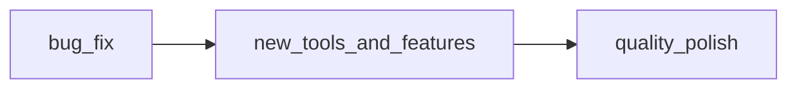
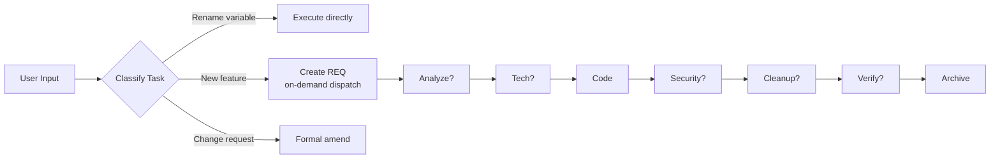
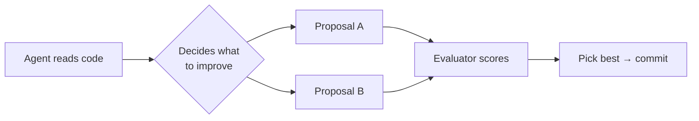
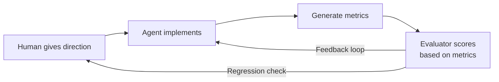

+++
date = '2026-04-25T12:00:00+08:00'
draft = false
title = '[Project] 6. Parallel Evolution — Two Independent AI Projects That Evolved the Same Way'
categories = ["Project"]
tags = ["AI", "Claude Code", "Project", "Evolution", "Architecture"]
+++

## One-Line Summary

Skills (a requirement-driven development framework) and Harness (an autonomous AI code improvement engine) are two projects started independently to solve different problems. Yet their evolution — from fixed pipelines to self-orchestration — followed nearly identical paths. This isn't a coincidence; it reveals an underlying pattern in how AI-collaborative projects naturally evolve.

---

## The Discovery: An Unexpected Convergence

Late last year, I started two projects:

- **Skills**: Turn the software development lifecycle — requirement analysis, technical design, coding, security review, verification, archival — into executable Claude Code skills
- **Harness**: Feed project code to an LLM and let it analyze, improve, and write its own code, forming an unattended self-improvement loop

Different problems. Different codebases. No shared design. But months later, looking at their git histories side by side, the evolutionary stages are strikingly similar:

| Stage | Skills | Harness |
|:---|:---|:---|
| **First version** | Fixed 6-stage pipeline, hardcoded order | Fixed 3-stage pipeline (bug_fix → features → polish) |
| **Modular split** | 8 independent sub-skills, separated concerns | Modular architecture (phase_runner / evaluator / pipeline) |
| **Orchestration** | Removed numbering, orchestrator dispatches on demand | Removed fixed stages, agent decides what to change |
| **Now** | Stable, iterating on demand | Metrics-driven: intel_metrics, cycle_metrics landed |

The pain points at each stage were identical: fixed pipelines are too rigid, modular splits create coordination overhead, and both eventually converged on "let the system decide what to do next."

---

## Stage 1: Fixed Pipeline

### Skills v1

A linear six-stage flow:

Every stage was hardcoded. You had to go through all six for every change, no matter how small. Problems emerged quickly:

- Small tasks required the full ceremony
- Interruptions meant difficult recovery
- No way to skip unnecessary stages

### Harness v1

Nearly the same pattern:

Three fixed stages. The LLM in each stage only knew its current task, not the overall goal. The result? Phase 2 refactored a file, Phase 3's LLM didn't know about it, and reverted the changes.

**Both projects started with fixed pipelines out of "let's just get it running." If we had known we'd end up with orchestrators, we might have designed differently — but making mistakes first is what made the later designs grounded.**

---

## Stage 2: Modular Split

As code grew, the limitations of fixed pipelines became harder to ignore. Both projects decomposed:

### Skills: Monolith → 8 sub-skills

One giant `req/SKILL.md` became 8 independent skill files, each with its own rules, templates, and skip conditions. A shared `_shared/` directory standardized state machine rules, recovery patterns, and commit conventions.

### Harness: Large files → separated packages

From mixed-concern files like `phase_runner.py` (401 lines), `evaluator.py` (109 lines), `pipeline.py` (175 lines) to four clean packages: `pipeline/`, `evaluation/`, `core/`, `tools/`.

**Shared lesson: Splitting solved "files are too big" but not "the flow is too rigid." Only after splitting did we realize the orchestration logic itself was the real problem.**

---

## Stage 3: Self-Orchestration

This was the pivotal evolution. Both projects independently made the same core change — **replace fixed sequences with on-demand dispatch**.

### Skills: The Orchestrator Pattern

The key change: remove all stage numbers and hardcoded ordering. Let the orchestrator read the filesystem, classify the task, and decide which stages to run.

The orchestrator is no longer a fixed assembly line — it's a **state observer and intelligent dispatcher**.

### Harness: Self-Directed Improvement

Same direction — removed the fixed three phases and dual-agent debate. Let the LLM read the code, decide what to improve, generate multiple proposals, and let an evaluator pick the best.

**Both projects realized: for a continuously iterating system, you can't predefine "what to do next." Letting the system decide is more robust than hardcoding the decision.**

---

## Stage 4: Metrics-Driven (In Progress)

Harness has entered this phase ahead of Skills:

Concrete components:
- `intel_metrics.py` — cross-cycle intelligence metrics
- `cycle_metrics.py` — per-cycle granular quality metrics
- `evaluator_calibration` — benchmarks to verify evaluator accuracy

Core insight: don't let the agent free-improve in a vacuum. Give it quantifiable signals so it knows whether it's actually getting better.

---

## Why Convergence Happens

Looking back, this isn't random. It's a natural consequence of **"AI + continuous iteration" projects**:

1. **First, you ship** — fixed pipeline is the fastest way to get running
2. **Then you hit rigidity** — so you split into modules
3. **Splitting creates coordination cost** — so you build an orchestrator
4. **Orchestrator needs better signals** — so you add metrics

**The orchestrator pattern isn't a project-specific design. It's a general paradigm.** Whether orchestrating a development workflow or a code improvement loop, the structure is the same: an observer reads state, a decision-maker chooses next steps, and executors carry them out.

---

## What This Means

**If you build one AI project, you think "that's just how my architecture ended up." Build two, and you see the pattern underneath.**

Practical takeaways:

1. **Maintain a long-term personal project** — vague intuitions from three months ago become executable code today. Without a project to carry them, those insights stay in your head and fade.

2. **Patterns emerge over time, not at design time** — Skills and Harness didn't plan this evolution. It emerged from iteration. If you chase perfect architecture on day one, you'll miss the insights that only come from building.

3. **Your collaboration history becomes a record** — scroll through git log and you can see how your AI collaboration evolved: from AI writing code snippets, to writing entire modules, to improving its own code. That's a better growth record than any summary post.

---

## One-Paragraph Summary

> Skills (a requirement-driven development workflow) and Harness (an autonomous AI code improvement engine) started as independent projects solving different problems. Over months of iteration, their architectures evolved through nearly identical stages: from fixed pipelines to modular splits, then to self-orchestration, and finally toward metrics-driven improvement. This isn't coincidence — for any "AI + continuous iteration" project, this seems to be an inherent evolutionary path. Build one project and you experience it; build two side by side and you see the pattern.
