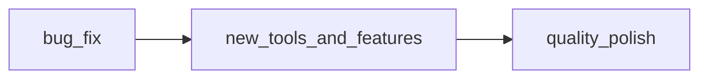
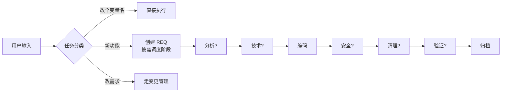
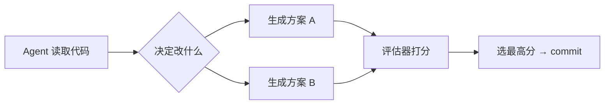
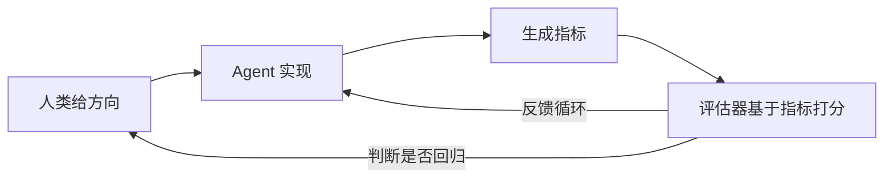

+++
date = '2026-04-25T12:00:00+08:00'
draft = false
title = '[Project] 6. 平行演化 — 两个独立 AI 项目的趋同进化之路'
featuredImage = "/images/Project%20-%206%20-%20Parallel%20Evolution/cover.png"
categories = ["Project"]
tags = ["AI", "Claude Code", "Project", "Evolution", "Architecture"]
+++

## 一句话介绍

Skills（需求驱动开发框架）和 Harness（AI 自主代码改进引擎）是两个独立启动、解决不同问题的项目。但它们从固定流水线到智能编排的演化路径几乎一模一样——这不是巧合，而是 AI 协作项目的一种内在规律。

---

## 发现：两条线的惊人重合

去年底开始做两个项目：

- **Skills**：把"需求分析 → 技术设计 → 编码 → 安全审查 → 验证 → 归档"做成 Claude Code 的可执行技能，让 AI 写代码有章法
- **Harness**：把项目代码喂给 LLM，让它自己分析、改进、写代码，形成一个无人值守的自我改进循环

两个项目解决的问题完全不同，代码也没有共享。但几个月后回头看它们的 git log，发现演化阶段惊人地一致：

| 阶段 | Skills | Harness |
|:---|:---|:---|
| **初版** | 固定 6 阶段流水线，硬编码顺序 | 固定 3 阶段流水线（bug_fix → features → polish） |
| **拆分** | 拆成 8 个独立子 skill，职责分离 | 拆成模块化架构（phase_runner / evaluator / pipeline） |
| **编排升级** | 去序号，编排者按需调度子 skill | 砍掉固定阶段，让 Agent 自行决定改什么 |
| **当前** | 稳定使用，持续按需迭代 | 指标驱动阶段：intel_metrics / cycle_metrics 已落地 |

每个阶段踩的坑都一样：固定流水线太死板、拆分后又发现协调成本高、最终都走向了"让系统自己判断下一步做什么"。

---

## 阶段一：固定流水线

### Skills 初版

第一个版本是六阶段线性流程：

每个阶段都是硬编码的，必须按顺序走完。简单直接，但问题很快就暴露了：

- 小需求也要走全部六个阶段，冗长
- 中途打断后恢复困难
- 无法跳过不必要的阶段

### Harness 初版

几乎一样的模式：

三阶段固定流程，LLM 在每个阶段只知道自己当前的任务，不知道整体目标。结果是——Phase 2 重构了某个文件，Phase 3 的 LLM 不知道，又改回去了。

**两个项目都是用"先让它跑起来"的心态做了固定流水线。如果当时知道最终会走向编排者模式，可能不会这么设计——但正是这种"先犯错再改进"的过程，才让后面的设计有了依据。**

---

## 阶段二：模块化拆分

代码越来越臃肿，固定流水线的缺点越来越明显。两个项目几乎同时走向了拆分：

### Skills: 单体 → 8 个子 skill

把一个巨大的 `req/SKILL.md` 拆成 8 个独立的 skill 文件，每个有自己的规则、模板、跳过条件。还加了共享规范目录 `_shared/`，统一管理状态机、恢复模式、提交规范。

### Harness: 大文件 → 职责分离

从 `phase_runner.py` (401 行)、`evaluator.py` (109 行)、`pipeline.py` (175 行) 这种混合结构，拆成 `pipeline/`、`evaluation/`、`core/`、`tools/` 四个包，每个职责明确。

**共同的教训：拆分解决了"文件太大"的问题，但没有解决"流程太死"的问题。拆完之后才发现，真正需要改的是编排逻辑。**

---

## 阶段三：智能编排

这是最关键的一次进化。两个项目在互不知情的情况下，做了同样的核心改变——**把"固定顺序"变成"按需调度"**。

### Skills: 编排者模式

核心转变：删掉所有序号，删掉固定编排顺序，让编排者基于任务内容自己判断跑哪些阶段。

编排者不再是"按顺序叫号"的流水线，而是一个**观察文件系统、自己决定下一步**的调度器。

### Harness: 自我编排

同样的方向——砍掉了固定的三阶段和双 Agent 辩论，让 LLM 自己读代码、自己决定改什么、生成多个方案、评估器选最好的。

**两个项目都认识到：对于持续迭代的系统，你不可能预先知道"下一步该做什么"。把这个判断交给系统自己，比硬编码靠谱得多。**

---

## 阶段四：指标驱动（进行中）

Skills 在这个阶段还在摸索。Harness 率先进入了指标驱动阶段：

- `intel_metrics.py` — 跨轮次的智能指标收集与分析
- `cycle_metrics.py` — 每个 cycle 的细粒度质量指标
- `evaluator_calibration` — 评估器校准基准

核心思路：不让 agent 在真空中自由发挥，而是用可量化的指标告诉它"做对了没有"。

---

## 为什么两条线会趋同

回头想，这不是巧合。可能的原因：

**只要是"AI + 持续迭代"的项目，都会碰到类似的问题：**
1. 一开始都是"先跑起来再说"，所以必然从固定流水线起步
2. 跑起来后发现流程太死，于是拆分模块
3. 拆分后需要协调，自然走向编排者模式
4. 编排者模式到了极限，需要更精细的评判信号，于是走向指标驱动

**编排者模式不是某个项目的特定设计，而是一个通用范式。** 不管编排的是开发流程还是代码改进，核心结构相同：一个观察者读取当前状态，一个决策者判断下一步，然后调度执行单元去完成。

---

## 这个发现告诉我们什么

**如果你只做一个 AI 项目，你会觉得"我的架构就应该是这样的"。做两个，才会发现背后有共通的规律。**

几个实用的建议：

1. **维护一个长期迭代的个人项目**——三个月前的模糊感觉，会变成三个月后可执行的代码。没有项目承载，这些认知就停留在脑子里。

2. **模式的浮现需要时间**——Skills 和 Harness 的平行演化不是设计出来的，是迭代出来的。如果你一开始就追求完美架构，反而可能错过这些洞察。

3. **AI 协作的能力会沉淀**——翻 git log 就能看到自己和 AI 的协作是怎么演化的：一开始 AI 只写代码片段，后来能写完整模块，再后来能自己改进自己的代码。没有比这更好的成长记录。

---

## 一段话总结

> Skills（需求驱动开发框架）和 Harness（AI 自主代码改进引擎）是两个独立启动、解决不同问题的项目。但在几个月的时间里，它们的架构演化走出了几乎完全相同的路径：从固定流水线到模块拆分，再到智能编排，最后走向指标驱动。这不是巧合——对于"AI + 持续迭代"的项目，这似乎是一种内在的演化规律。做两个项目，你才会发现这个规律；做一个长期项目，你才能亲身经历它。
