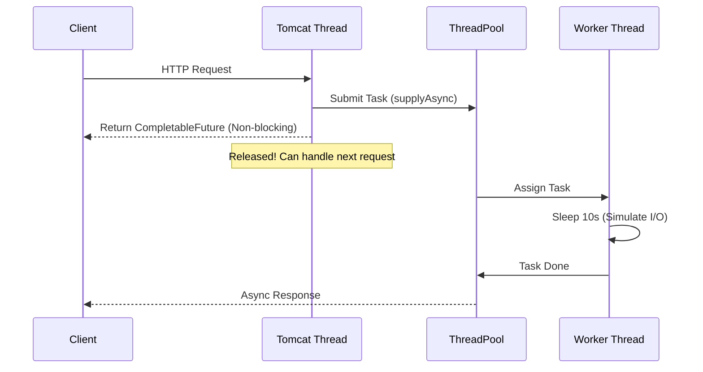

```mermaid
sequenceDiagram
    participant Client
    participant Tomcat as Tomcat Thread
    participant Pool as ThreadPool
    participant Worker as Worker Thread

    Client->>Tomcat: HTTP Request
    Tomcat->>Pool: Submit Task (supplyAsync)
    Tomcat-->>Client: Return CompletableFuture (Non-blocking)
    Note over Tomcat: Released! Can handle next request

    Pool->>Worker: Assign Task
    Worker->>Worker: Sleep 10s (Simulate I/O)
    Worker->>Pool: Task Done
    Pool-->>Client: Async Response
```
