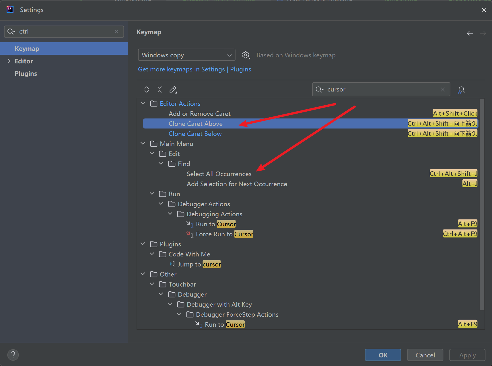

# 模版配置

## 介绍

- 工欲善其事必先利其器，idea作为当今Java最好用的编辑器（没有之一），我多次把它打造成了当时手上最好用的工具。
- 这里简单分享一些只要配置了，就完全可以直接使用去优化的点。
- 在项目里经常遇到没有format、存在未使用import、没有尾行等情况，其实这些是比较不该存在的。
  - 最重要的是，这些都可以通过配置来解决

## 设置

### 表头设置

- File–>settings–>Editor–>File and Code Templates–>Includes

```
/**
 * TODO
 *
 * @author Goody
 * @version 1.0, ${DATE}
 * @since 1.0.0
 */
```

### import 没有\*

```
editor -> Code Style -> Java -> Class count to user import with '*' -> 调大
```

- 一般的标准里，都不会允许有import *。 虽然对性能影响较小，但是这里有两个巨大的问题
    1. 增大了JAR包体积
    2. 多个import*的时候，可能会引入同名类，导致编译错误。
- idea里设置此处后，会自动切换为所有的特定引入

### 自定义快捷输入

- NOTE & TODO

```bash
Editor -> Live Templates -> "// NOTE(goody): $date$"
```

### 单行注释不换行

```bash
Editor -> Code Style -> Java -> JavaDoc -> Other -> Do not warp one line comments
```

### 尾行自动设置

```bash
Setting -> Editor -> General -> On Save -> Ensure every saved file ends with a line break
```

- Java编译器，一般要求类、方法等都必须以一个换行符结尾，以正确地解析结构。所以尾行一般是必要的。

### 提交时自动格式化代码


### 本地变量自动增加final

- 除了很明显的不可修改之类的特性之外。
- 在逃逸分析里
  1. 经典的一个场景就是当变量未逃逸时，直接在栈中清理。而不用入堆进行后续的GC
  2. final关键字修饰之后，返回对象会直接放在栈顶部，用以减少内存的读写次数


### 其他自定义后缀快捷输入


### CamelCase


## 快捷键

- 这里仅推荐一个巨好用的快捷键，光标相关


