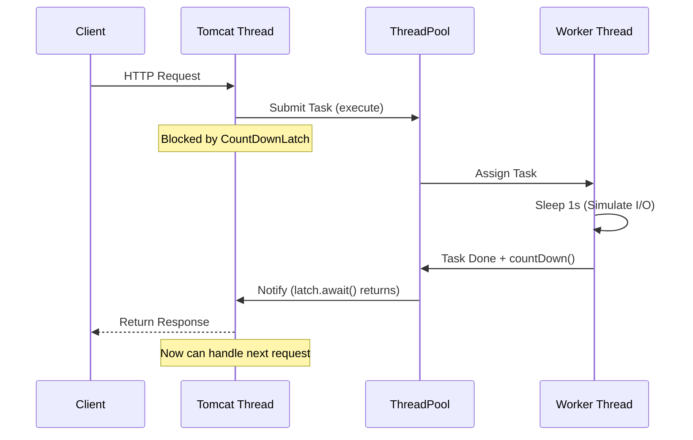

```mermaid
sequenceDiagram
    participant Client
    participant Tomcat as Tomcat Thread
    participant Pool as ThreadPool
    participant Worker as Worker Thread

    Client->>Tomcat: HTTP Request
    Tomcat->>Pool: Submit Task (execute)
    Note over Tomcat: Blocked by CountDownLatch

    Pool->>Worker: Assign Task
    Worker->>Worker: Sleep 1s (Simulate I/O)
    Worker->>Pool: Task Done + countDown()
    Pool->>Tomcat: Notify (latch.await() returns)
    Tomcat-->>Client: Return Response
    Note over Tomcat: Now can handle next request
```
